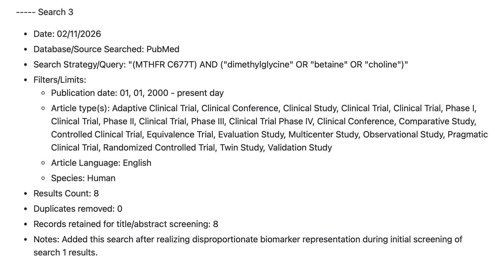

```{css, echo = FALSE}
.justify {
  text-align: justify !important
}
```

::: {.justify}

### <u>1.2.1 PRISMA-Informed Approach</u>

Due to the scope and scale of this capstone, part 1 of this project was designed as a targeted, PRISMA-informed synthesis rather than an exhaustive systematic review. PRISMA (Preferred Reporting Items for Systematic Review and Meta-Analyses) is a guideline used in professional settings to improve reporting of systematic reviews against bias (Page et al., 2021). Other PRISMA techniques used in this analysis were a PRISMA-styled explicit search strategy, pre-defined inclusion/exclusion criteria, and a study characteristics table. I chose this approach to ensure any biomarker profile established in the analysis was grounded in systematically reviewed mechanistic literature, and that any conclusions made were based on rigorous criterion and were transparently justified.

It is important to note that I chose to perform a narrative synthesis instead of a full meta-analysis because my project does not include pooling, which is a critical component of a true meta-analysis. Pooling, which is the numerical merging of results across studies, assumes that variables being pooled are comparable across populations, assays, conditions, and reporting methods (Dagher & Khan, 2025). Since several biomarkers I am evaluating demonstrate variability across these factors, a directional synthesis is a more appropriate approach for this analysis. . 

### <u>1.2.2 Search Strategy</u>

Per PRISMA guidelines, for every source searched, the following information was recorded: date of search, database/source, search strategy/query, any filters or limits, language, publication type, results count, number of duplicates removed, the number of records retained for screening, and any notes of importance. Records were tracked in 'prisma-screening-tracker.csv', which can be found in the 'references/ part1' folder of this project’s GitHub repository (https://github.com/colette-osiris/mthfr-fld-capstone). 

An example of a search log entry is provided below: 


{fig-align="center" width="80%"}

### <u>1.2.3 Screening Workflow</u>

Once records were obtained and recorded for a given search query, screening for that source proceeded. Screening procedure followed a two-stage process: a title/abstract screening, then followed by a full-text review. Records were tracked in 'prisma-screening-tracker.csv', and search decisions were logged in 'prisma-search-log.md', both of which can be found in the 'references/part1' folder of this project’s GitHub repository (https://github.com/colette-osiris/mthfr-fld-capstone). Screening continued for each query until the full resulting dataset was assessed and achieved a minimum of 2 sources per biomarker for directional evaluation.

### <u>1.2.4 Eligibility Criteria</u>

Studies were evaluated for inclusion based on pre-defined criteria, as per PRISMA framework. Eligibility was based on if a source met the following criteria: 

- Peer-reviewed, 2000 or later publication date 
- MTHFR C677T genotypically stratified, either CC/CT/TT or TT vs. non-TT (CC/CT) 
- 1+ biomarker measured biologically (not via dietary intake or self report) and reported quantitatively[^1] 
- Comparable assay methodology (within biomarker class) 
- For intervention studies: include baseline/control genotype-stratified biomarker data only

[^1]: In this context, quantitatively is defined as mean ± SD, median with interquartile range or spread, a reportable effect estimate, or figure-extractable values.

Studies were excluded if they met the following criteria: 

- Intervention studies where patient comorbidities are expected to impact one-carbon metabolism
- Studies that meet inclusion criteria but only report post-treatment metrics 
- Outcomes irrelevant to one-carbon metabolism or liver biology
- Self reported biomarker intake or other proxy measures 
- No genotype stratification 


### <u>1.2.5 Study Characteristics Table</u>

Here is the study characteristics table for the sources that were included for each biomarkers' synthesis. 

```{r}
#| label: study-characteristics-table
#| code-fold: true
#| output: true

# STUDY CHARACTERISTICS TABLE BY BIOMARKER -------------

#read in study characteristics data from manual excel input 
study.characteristics.01 <- readxl::read_excel("../data/clean_data/study-characteristics-table.xlsx",
  .name_repair = "universal")
##explore data 
glimpse(study.characteristics.01)
names(study.characteristics.01)

#flextable formatting from PLSC476 
study_characteristics_flextable <- study.characteristics.01 %>% 
  flextable::flextable() %>% 
  flextable::set_header_labels(
  N.Range = "N Range",
  Types.of.Evidence = "Types of Evidence",
  Contributing.Studies = "Contributing Studies") %>%
  flextable::theme_booktabs(bold_header = TRUE) %>% 
  flextable::align(align = "center", part = "all") %>% 
  flextable::valign(valign = "bottom", part = "header") %>% 
  flextable::padding(padding = 1, part = "all") %>% 
  flextable::border_inner_h(
    border = officer::fp_border(color = "gray60", width = 0.5),
    part = "all"
  ) %>%
  flextable::border_inner_v(
    border = officer::fp_border(color = "gray60", width = 0.5),
    part = "all"
  ) %>%
  flextable::border_outer(
    border = officer::fp_border(color = "gray40", width = 0.75),
    part = "all"
  ) %>%
  #footnotes per discussion - NORCCAP cohort overlap + abbreviations 
  flextable::add_footer_lines("Note: The NORCCAP cohort (n=10,601 Norwegian adults) contributed to multiple analyses represented in this table: Hustad 2007, Midttun 2007, Fredriksen 2007, and Holm 2007.") %>% 
  flextable::add_footer_lines("Abbreviations: GWAS = genome-wide association study; RCT = randomized controlled trial; LC-MS/MS = liquid chromatography-tandem mass spectrometry; BHMT = betaine-homocysteine methyltransferase.") %>% 
  flextable::autofit()


#view it 
study_characteristics_flextable

#save flextable 
flextable::save_as_image(x = study_characteristics_flextable, 
                         path = here::here("tables", "part1", "study_characteristics.png"))
```


::: 